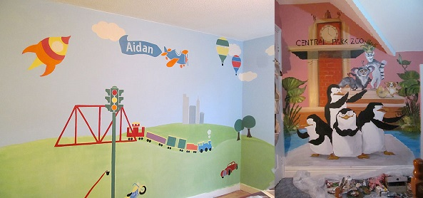

# decor
four seasons decor

<!DOCTYPE html>
<html lang="en">
<head>
<meta charset="UTF-8">
<title>Example of Twitter Bootstrap 3 Thumbnails</title>
<link rel="stylesheet" href="https://maxcdn.bootstrapcdn.com/bootstrap/3.3.1/css/bootstrap.min.css">
<link rel="stylesheet" href="https://maxcdn.bootstrapcdn.com/bootstrap/3.3.1/css/bootstrap-theme.min.css">

</head>
<body>

<ul class="dropdown-menu" role="menu" aria-labelledby="dropdownMenu1">
<li role="presentation"><a role="menuitem" tabindex="-1" href="#">Pierwsza opcja</a></li>
<li role="presentation"><a role="menuitem" tabindex="-1" href="#">Druga opcja</a></li>
<li role="presentation"><a role="menuitem" tabindex="-1" href="#">Trzecia opcja</a></li>
<li role="presentation" class="divider"></li>
<li role="presentation"><a role="menuitem" tabindex="-1" href="#">Czwarta opcja</a></li>
</ul>

<nav class="navbar navbar-default" role="navigation">

<!-- Grupowanie "marki" i przycisku rozwijania mobilnego menu -->

<button type="button" class="navbar-toggle" data-toggle="collapse" data-target="#bs-example-navbar-collapse-1">
Rozwiñ nawigacjê

</button>
<a class="navbar-brand" href="#" style = "font-family: Bernard Font; color: brown; font-size: 1.2em;">FSD</a>

<!-- Grupowanie elementów menu w celu lepszego wyœwietlania na urz¹dzeniach moblinych -->

<ul class="nav navbar-nav">
<li class="active"><a href="index.html">Home (current)</a></li>
<li class="active"><a href="aboutUs.html">About Us (current)</a></li>
<li class="dropdown">
<a href="#" class="dropdown-toggle" data-toggle="dropdown">Murals</a>
<ul class="dropdown-menu" role="menu">
<li><a href="forKids.html">For Kids</a></li>
<li><a href="murals.html">Exterior/Interior</a></li>
<li class="divider"></li>
<li><a href="contact.html">Contact</a></li>
<li class="divider"></li>
</ul>
<li class="dropdown">
<a href="#" class="dropdown-toggle" data-toggle="dropdown">Paintings </a>
<ul class="dropdown-menu" role="menu">
<li><a href="horses.html">Horses</a></li>
<li><a href="landscapes.html">Landscapes</a></li>
<li><a href="portraits.html">Portraits</a></li>
<li><a href="sea.html">Sea Landscapes</a></li>
<li><a href="ravens.html">Ravens</a></li>
<li><a href="surrealism.html">Surrealism</a></li>
<li><a href="creatures.html">Creatures</a></li>
<li class="divider"></li>
<li><a href="contact.html">Contact</a></li>
<li class="divider"></li>
</ul>
</li>
</ul>

<!-- /.navbar-collapse -->

<!-- /.container-fluid -->
</nav>

<h3 style = "font-family: Bernard Font; color: brown;">Exterior /Interior 
Murals
</h3>

 <b> Four Seasons Decor </b>is about transforming your space to match your dreams .
With us you can realise your own vision of art.
You can describe for us your project and we will create an artistic expression of your idea.
We offer wall painting for living rooms, kitchens, kids rooms and exterior spaces

 <a href="murals.html" class="btn btn-default">More</a>

<h3 style = "font-family: Bernard Font; color: brown;">Paintings</h3>

Paintings reveal the way we see and feel the world around us and the world within us.In <b>Four Seasons Decor</b> gallery, dominating forms are oil painting and acrylic painting, but we can also work using other media such as board or glass painting.You can describe for us your project and we will create an artistic expression of your idea. 

 <a href="paintings.html" class="btn btn-default">More</a>

<h3 style = "font-family: Bernard Font; color: brown;">Murals for Kids</h3>

A mural is any piece of artwork painted or applied directly on a wall, ceiling or other large permanent surface.
A distinguishing characteristic of mural painting is that the architectural elements of the given space are harmoniously incorporated into the picture.

 <a href="forKids.html" class="btn btn-default">More</a>

<h3 style = "font-family: Bernard Font; color: brown;">Portraits</h3>

Four Seasons Decor is a guarantee of a top quality design, flawless technique and that unique personal touch which makes all the difference.You can describe for us your project and we will create an artistic expression of your idea. 

 <a href="portraits.html" class="btn btn-default">More</a>

<footer>

If you wish to get in touch with Four Seasons Decor: <a href="contact.html">ContactUs</a>

Contact information: <a href="mailto:urrskupis@gmail.com">
urrskupis@gmail.com</a>. phone no: 0851455068 Adress:Priorsgate, Greenhills Rd. Dublin24

</footer>

</body>
</html> 
